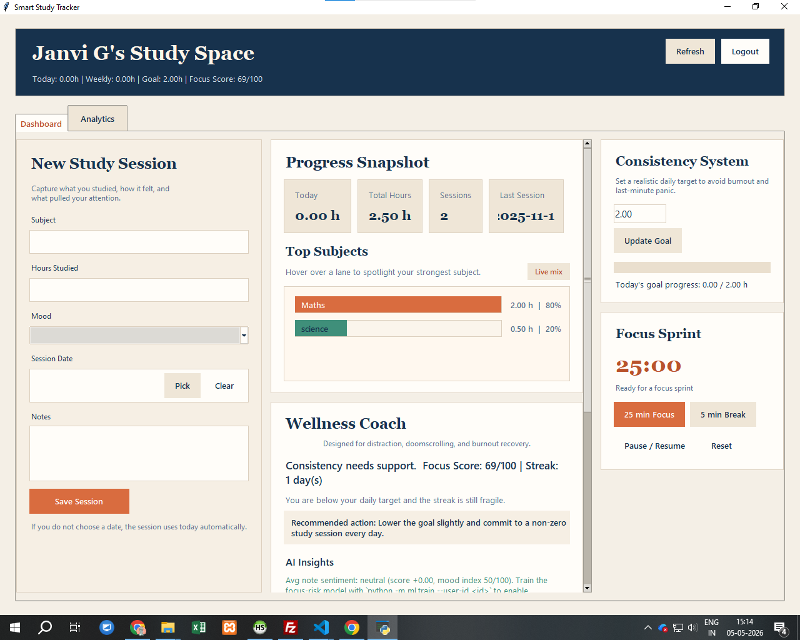
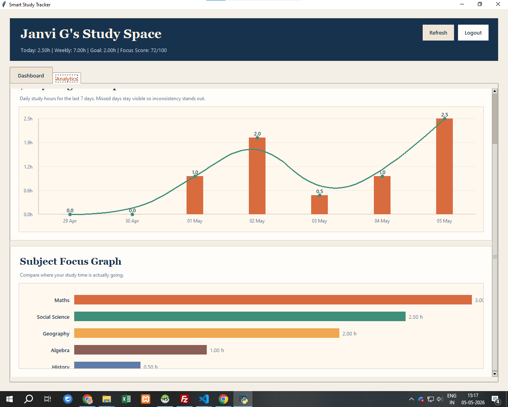

# Smart Study Tracker

> A Python desktop application that combines a Tkinter dashboard, a MySQL data layer, and a small ML stack (VADER sentiment + scikit-learn logistic regression) to turn raw study sessions into actionable, AI-driven coaching.


---

## Why this project exists

Most study trackers count hours. This one tries to answer *why some sessions land and others don't* — by joining structured fields (mood, hours, subject, date) with unstructured notes, scoring those notes with VADER, and training a small classifier that flags upcoming sessions as **low-focus risk** before they happen.

It is built end-to-end:

| Layer | Tools |
|---|---|
| **UI** | Python 3.10, Tkinter, custom canvas charts |
| **Data** | MySQL 8 (5 tables, parameterised queries, recursive CTE for daily progress) |
| **ML / NLP** | `vaderSentiment` for note sentiment, `scikit-learn` `Pipeline` + `LogisticRegression` for focus-risk |
| **Analysis** | `pandas`, `seaborn`, `matplotlib`, `scipy.stats`, Jupyter |
| **Ops** | `python-dotenv` for secrets, `joblib` for model persistence, GitHub Actions for CI |

## Demo

> Add a `docs/demo.gif` and reference it here:
>
> ```markdown
> 
> ```

| Dashboard | Analytics |
|---|---|
|  |  |

(Capture screenshots into `docs/` after running the app.)

---

## What the AI layer does

### 1. Sentiment analysis on notes (`ml/sentiment.py`)

Every time a session is saved, the free-text note is scored with VADER's compound polarity (-1 to +1). The score is persisted to `study_sessions.sentiment_score` and surfaced live in the **Wellness Coach** card. When ≥50% of recent notes trend negative, the coach changes its recommendation.

### 2. Focus-risk classifier (`ml/focus_classifier.py`)

A scikit-learn `Pipeline` (`StandardScaler` + `OneHotEncoder` → `LogisticRegression`) trained on engineered features:

| Feature | Source |
|---|---|
| `hours` | session input |
| `mood` (one-hot) | dropdown value |
| `hour_of_day`, `day_of_week` | derived from `created_at` / `session_date` |
| `days_since_last` | recency gap (clipped 0–14) |
| `rolling_7d_hours` | pandas `.rolling("7D")` over user history |
| `sentiment_score` | VADER on latest note |

Labels are derived from outcome data (mood ∈ {Stressed, Tired} OR sentiment ≤ -0.2 → low-focus). The trained pipeline is persisted to `models/focus_classifier.joblib` and loaded lazily on the dashboard's refresh cycle, so the UI shows a live "Predicted low-focus risk: 32% (low)" insight.

### 3. EDA notebook (`notebooks/analysis.ipynb`)

A self-contained pandas/seaborn notebook covering:

1. Daily-hours time series + 7-day rolling mean
2. Subject concentration (top-N bar chart)
3. Mood × hours-per-session boxplot
4. Sentiment distribution + positive/negative thresholds
5. Pearson + Spearman correlation between sentiment and hours
6. Day-of-week productivity patterns
7. Findings → modeling implications

It uses the same `db_config.get_connection()` so it hits whatever MySQL instance you point the app at.

---

## Architecture

```
┌──────────────────┐        ┌─────────────────────┐        ┌──────────────────┐
│  Tkinter UI      │──────▶ │  tracker_utils.py    │──────▶ │  MySQL           │
│  (main.py)       │        │  - log_study_session │        │  - users         │
│  - Dashboard tab │ ◀──────│  - get_dashboard_*   │ ◀──────│  - study_sessions│
│  - Analytics tab │        │  - build_wellness_*  │        │  - user_prefs    │
│  - Custom canvas │        │  - get_focus_predict │        │  - user_badges   │
└──────────────────┘        └──────────┬───────────┘        │  - login_history │
                                       │                    └──────────────────┘
                                       ▼
                            ┌──────────────────────┐
                            │  ml/                 │
                            │  - sentiment.py      │  ← VADER
                            │  - focus_classifier  │  ← sklearn Pipeline
                            │  - train.py (CLI)    │
                            └──────────┬───────────┘
                                       ▼
                            models/focus_classifier.joblib
```

### Database schema (5 tables)

```
users ─────┬───< study_sessions      (subject, hours, mood, sentiment_score, predicted_focus, notes)
           ├───< user_preferences    (daily_goal_hours, popup tracking)
           ├───< user_badges         (streak milestones)
           └───< login_history       (audit trail)
```

Full DDL: [`init_db.sql`](init_db.sql). The app also runs idempotent `ALTER TABLE … ADD COLUMN IF MISSING` migrations on startup, so existing installs upgrade cleanly.

---

## Quick start

### 1. Clone & install

```bash
git clone https://github.com/<your-username>/smart-study-tracker.git
cd smart-study-tracker
python -m venv .venv
.venv\Scripts\activate            # PowerShell
# source .venv/bin/activate         # macOS/Linux
pip install -r requirements.txt
```

### 2. Configure MySQL

```bash
cp .env.example .env               # Windows: copy .env.example .env
```

Edit `.env`:

```
STUDY_TRACKER_DB_HOST=127.0.0.1
STUDY_TRACKER_DB_PORT=3306
STUDY_TRACKER_DB_USER=root
STUDY_TRACKER_DB_PASSWORD=your_local_password
STUDY_TRACKER_DB_NAME=study_tracker
```

The app creates the database and tables automatically on first run. If you'd rather provision manually, use [`init_db.sql`](init_db.sql).

### 3. Run the app

```bash
python main.py
```

Register a user, log a few sessions with notes — the sentiment column populates automatically.

### 4. Train the focus-risk model (after ~15+ sessions)

```bash
python -m ml.train --user-id 1
```

Output:

```
Loading sessions from MySQL...
  loaded 42 session rows
Training logistic regression...
  test accuracy: 0.812
  train rows:    31
  test rows:     11
Saved model to models/focus_classifier.joblib
```

The dashboard's "AI Insights" card picks the model up on the next refresh.

### 5. Run the EDA notebook

```bash
jupyter lab notebooks/analysis.ipynb
```

---

## Project layout

```
smart-study-tracker/
├── main.py                       # Tkinter UI, dashboard, analytics, popups, timer
├── tracker_utils.py              # Auth, DB queries, wellness insights, ML hooks
├── db_config.py                  # MySQL connection (env-only credentials)
├── init_db.sql                   # Manual DDL
├── ml/
│   ├── sentiment.py              # VADER wrapper
│   ├── focus_classifier.py       # sklearn Pipeline + feature engineering
│   └── train.py                  # CLI: pull DB → train → save model
├── models/                       # Persisted joblib models (gitignored content)
├── notebooks/
│   └── analysis.ipynb            # pandas/seaborn EDA
├── docs/                         # Screenshots, demo gif (add your own)
├── .github/workflows/ci.yml      # Lint + syntax check on push/PR
├── requirements.txt
├── .env.example
├── .gitignore
└── LICENSE
```

---

## What I learned building this

- **Data plumbing** — designed a 5-table relational schema with cascade deletes, recursive CTE for filling missing days, and idempotent column migrations.
- **NLP integration** — chose VADER over a transformer for speed + zero model download; validated the choice with a Pearson correlation on real data.
- **Feature engineering** — turned raw rows into rolling 7-day windows, recency gaps, and one-hot mood encoding for the classifier.
- **End-to-end ML** — scoped a small problem (binary low-focus risk), built a `Pipeline` with `class_weight="balanced"` to handle the natural mood-class imbalance, persisted with `joblib`, and surfaced predictions in the UI without blocking the event loop.
- **Production hygiene** — env-var-only credentials, secret-aware `.gitignore`, defensive ML loading (the app runs fine without a trained model).

---

## Roadmap

- Time-series forecast of weekly hours (Prophet / ARIMA) → project goal attainment.
- Topic modeling over `notes` (BERTopic or TF-IDF + KMeans) → surface recurring distractions.
- Replace heuristic streak rules with a survival-analysis model.
- Migrate to PostgreSQL + a thin FastAPI layer so the same data backs a web UI.

---

## License

MIT — see [LICENSE](LICENSE).
